<h3><b>Step 1:</b> Click on "Next"</h3>

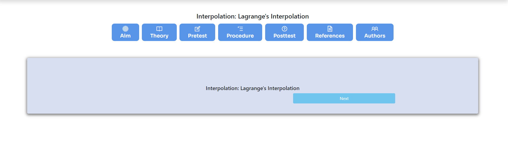

<h3><b>Step 2:</b> Calculate L1, L2, L3 and L4</h3>

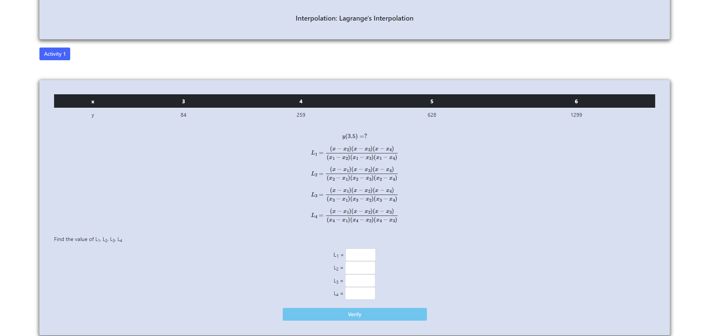

<h3>Then click on "Verify"</h3>

<h3><b>Step 3:</b> Calculate Y1L1, Y2L2, Y3L3 and Y4L4</h3>

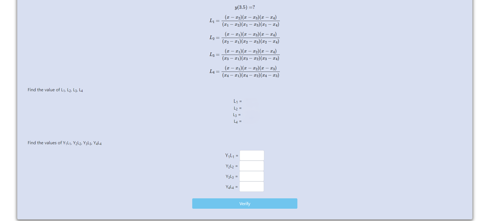

<h3>Then click on "Verify"</h3>

<h3><b>Step 4:</b> Calculate Y</h3>

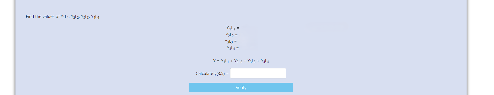

<h3>Then click on "Verify"</h3>

<h3><b>Step 5:</b> Click on "OK"</h3>

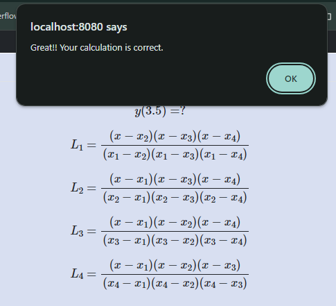

<h3>Activity 2 will begin.</h3>

<h3><b>Step 6:</b> Calculate L1, L2, L3 and L4</h3>

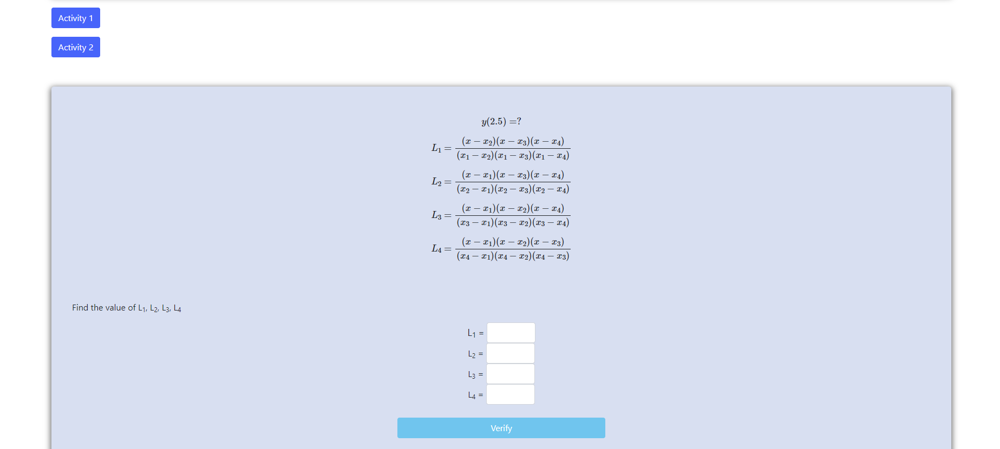

<h3>Then click on "Verify"</h3>

<h3><b>Step 7:</b> Calculate Y1L1, Y2L2, Y3L3 and Y4L4</h3>

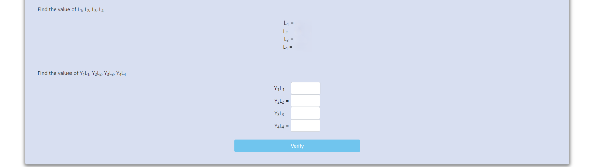

<h3>Then click on "Verify"</h3>

<h3><b>Step 8:</b> Calculate Y</h3>

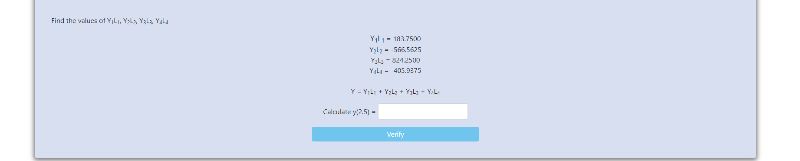

<h3>Then click on "Verify"</h3>

<h3><b>Step 9:</b> Click on "OK"</h3>

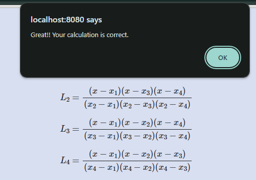

<h3>Then click on "Next"</h3>

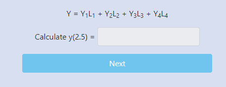

<h3><b>Step 10:</b> Click on "OK"</h3>

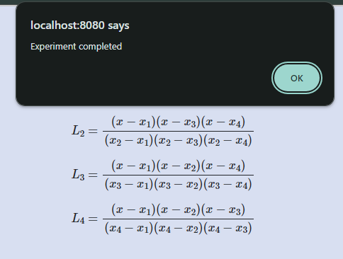

<h3>Experiment completed</h3>